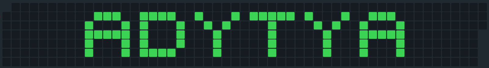

<b>GitHub Contribution Pattern Generator</b>

Design your pattern once, choose how to use it - as real contributions or as an image

## 📑 Table of Contents
- [Features](#-features)
- [How It Works](#️-how-it-works)
- [Usage Guide](#-usage-guide)
- [Important Notes](#️-important-notes)
- [License](#-license)
- [Connect With Me](#-connect-with-me)

## ✨ Features

After designing your pattern, this tool offers two ways to use it:

### 1. As Real Contributions
- Export a schedule of dates for making real GitHub contributions
- Get exact dates when you need to contribute
- Preview how your pattern will look
- Perfect for creating actual GitHub contribution patterns

### 2. As an Image
- Export your pattern as a PNG instantly
- Use the exported image in:
  - GitHub README files
  - Profile banners
  - Social media
  - Presentations

## ⚙️ How It Works

### Basic Pattern Creation
1. Enter your desired text/pattern (max 8 characters)
2. Choose the target year
3. Preview the pattern
4. Choose your export method:

#### For Real Contributions:
- Keep "Random Contributions" OFF
- Export the contribution schedule
- Follow the schedule to make real contributions

#### For Images:
- You could either Toggle "Random Contributions" ON or OFF
- Export as PNG
- Use immediately anywhere

## ⚠️ Important Notes

- For real contributions: requires consistent GitHub activity on specified dates
- For images: instant export, no real contributions needed
- Plan ahead for real contribution patterns
- Images can be used immediately

## 📄 License

This project is licensed under the MIT License. See the [LICENSE](LICENSE) file for details.

---

### 🤝 Connect With Me

If you found this project interesting, please consider giving it a 🌟

